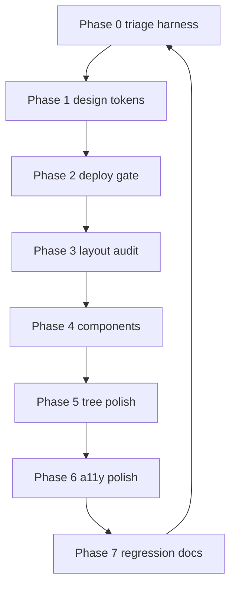

# Beautify Path of Building — Ironclad Multiphase Plan

> Goal: turn the "utterly broken" Qt/QML UI into a consistent, polished, dark
> "Cyber Citrus" app with an **objective, repeatable** verification harness.
>
> Anchoring evidence: `skill_tree/legacy.png` vs `skill_tree/new.png` and
> `import/legacy.png` vs `import/new.png` (legacy = working SimpleGraphic UI;
> new = current Qt port).

## Why styles keep breaking (root-cause summary)

1. **Deploy gap (most likely culprit).** `ninja` builds `build-win/pob-qt.exe`;
   `run_pob_fusion.bat` launches `dist/pob-qt.exe`. Without `cmake --install
   build-win --prefix <repo_root>`, the running binary never contains the
   theme/tree/layout changes. This exact gap was the root cause in
   [`plans/style_fix_pass2.md`](plans/style_fix_pass2.md).
2. **Incomplete design system.** [`src/Modules/UITheme.lua`](src/Modules/UITheme.lua)
   + [`app/src/Theme.cpp`](app/src/Theme.cpp) only define a *subset* of tokens
   (bg, accent, section, text, muted, sizes). No typography scale, radii,
   spacing scale, state colors (hover/active/disabled), or elevation. Views
   hand-roll the missing pieces inconsistently.
3. **Per-view hand-rolled layouts.** Each of the 10 views in
   [`app/qml/main.qml`](app/qml/main.qml) re-implements spacing/alignment,
   causing drift (text overlap, LIST clipping, import hidden).
4. **No objective measurement.** "Broken" is judged by eye; there is no
   screenshot-diff gate, so regressions are invisible until a human looks.

## Design principles

- **One pipeline.** The QML `theme` object *is* the C++ `Theme` singleton
  (no `Theme.qml`). Every view reads tokens from `theme`. No hardcoded hex.
- **Tokens live in Lua.** All design tokens are authored in `UITheme.lua`
  (engine-agnostic) and exposed by `Theme.cpp`. `src/` Lua is never edited.
- **Components over copy-paste.** Shared QML components eliminate per-view drift.
- **Measure, don't eyeball.** A screenshot-diff harness makes beautify verifiable.

## Phases

### Phase 0 — Triage & Objective Measurement
- Build a capture+diff harness: offscreen `pob-qt` (or `QQuickWindow::grabWindow`)
  captures every view (TREE, SKILLS, ITEMS, CALCS, CONFIG, NOTES, IMPORT,
  COMPARE, PARTY, LIST) at a fixed window size.
- Diff each `new.png` against its `legacy.png` reference using structural metrics
  (dimensions, mean color, histogram, SSIM) → per-view "broken vs reference" delta.
- Verify the deploy gap: assert `dist/pob-qt.exe` timestamp == `build-win/pob-qt.exe`
  (or add a version assertion in `main.cpp`).
- Output: `plans/beautify_triage.md` with a per-view defect table.

### Phase 1 — Complete Design System (single source of truth)
- Extend [`src/Modules/UITheme.lua`](src/Modules/UITheme.lua) with a full token set:
  - Typography: `fontFamily`, `fontSize` base + scale, `lineHeight`, weights.
  - Spacing scale: `space1..space6` (4/8/12/16/24/32).
  - Radii: `radiusControl` (4), `radiusCard` (8), `radiusPill` (999).
  - Semantic colors: `success` (#22C55E), `warning` (#F59E0B), `danger` (#EF4444),
    `info` (#06B6D4).
  - State colors: `hover`, `active`, `disabled` overlays; `border`, `borderStrong`.
  - Elevation: `shadow1..shadow3`.
- Extend [`app/src/Theme.h`](app/src/Theme.h) / [`app/src/Theme.cpp`](app/src/Theme.cpp)
  to parse + expose every new token as a `Q_PROPERTY` (CONSTANT).
- Add a `contrastOk(fg, bg)` helper to enforce AA.

### Phase 2 — Deploy & Verification Gate
- Enforce one-command build+install+launch (from `style_fix_pass2.md`):
  `ninja && cmake --install build-win --prefix <repo_root>`.
- Add a pre-launch assertion that the running binary matches the built binary
  (timestamp/version) so stale-binary regressions are caught immediately.
- Wire the Phase 0 harness as a `verify` step.

### Phase 3 — Layout & Density Audit (per view)
- Audit all 10 views for: consistent margins (use `Layout.*`, never `anchors`
  inside `StackLayout`), text elision (`elide: Text.ElideRight` + `clip`),
  alignment, scrollability (`ScrollView` on overflow), min/max widths, and
  small/large window responsiveness.
- Fix known defects: import-view visibility (content `Rectangle` always visible),
  nav-label overlap, top-bar overflow, LIST clipping (`Layout` margins),
  tree zoom smoothness (transform-only, no repaint on `transformChanged`).
- Produce a per-view checklist driven by the Phase 0 delta.

### Phase 4 — Reusable Component Library
- Extract shared components into `app/qml/components/`: `Button` (primary/
  secondary/ghost), `Card`, `SectionHeader`, `TextField`, `ComboBox`, `CheckBox`,
  `Tooltip`, `Badge`, `EmptyState`, `ScrollContainer`. All themed via `theme`
  with hover/active/disabled/focus states.
- Refactor each view in [`app/qml/main.qml`](app/qml/main.qml) to use the
  components, removing per-view styling drift.

### Phase 5 — Passive Tree Visual Polish
- Background image, node sprite frames, connector styling (active vs inactive,
  animated allocation), search highlight, hover tooltip, zoom/pan inertia.
- Keep 60fps via transform-only updates (no `requestPaint` on `transformChanged`).

### Phase 6 — Visual Polish & Accessibility
- Focus rings (theme.accent), consistent view transitions, empty/error/loading
  states, rarity colors in ITEMS, stat-type colors in CALCS, AA contrast pass,
  font rendering (hinting/antialias), consistent tooltips/iconography.

### Phase 7 — Regression & Documentation
- Finalize the screenshot-diff harness as a repeatable verify gate.
- Update `.obsidian-vault/01_Wiki/` notes (`Architecture.md`, `Core Controllers.md`)
  with `last_modified` + design-system notes (repo rule).
- Add `STYLE.md` design-system reference.

## Workflow

## Verification (every phase)
- `pob-qt --headless` prints `SELFTEST PASSED`; offscreen `pob-qt` shows 0
  QML/JS errors (`qrc:/|QML|TypeError|ReferenceError|is not defined`).
- Phase 0 harness delta shrinks to ~0 vs `legacy.png` references.
- `cmake --install` run; `dist/pob-qt.exe` matches built binary.
