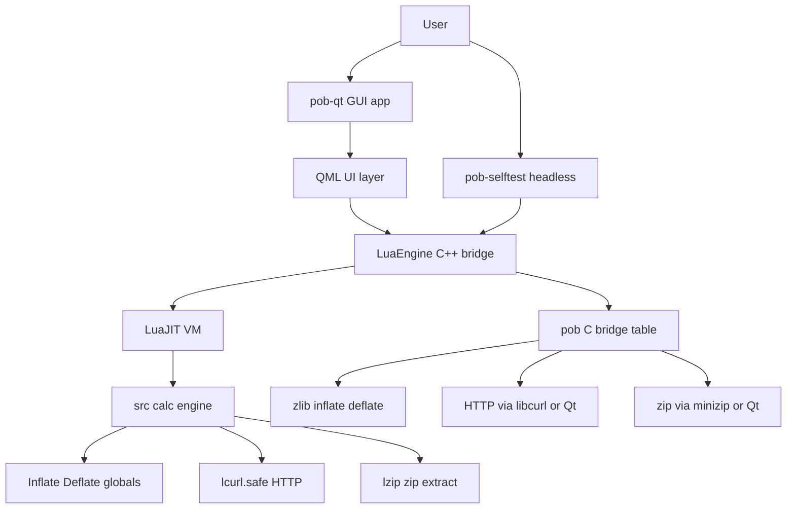

# Path of Building — Qt6/QML + LuaJIT Migration: Master Plan

> Single source of truth for the UI-modernization migration. Consumed by
> **Orchestrator** mode, which spawns `code`/`debug` sub-tasks per phase.
> Last revamped: 2026-07-12 (Architect pass).

## 1. Goal and Non-Goals

**Goal:** Replace the Windows-only SimpleGraphic host with a cross-platform
**Qt6 (QML/Qt Quick) + C++** frontend that embeds the existing **LuaJIT calc
engine** (`src/`) unchanged. The Lua code is the product; the host is plumbing.

**Non-Goals (hard constraints):**
- Do **not** port UI tabs yet except where a phase explicitly says so.
- Do **not** modify `src/` Lua calc logic (only `app/` and the `require` shim
  in `app/lua/pob_host.lua` may change).
- Do **not** remove SimpleGraphic references (that is Phase 6).
- Keep the headless `pob-selftest` green at every phase boundary.

## 2. Target Architecture

The bridge seam is **`app/lua/pob_host.lua`** (defines engine globals, routes
them to the `pob` C table) plus **`app/src/LuaEngine.cpp`** (registers the `pob`
table and the `l_pob_*` C callbacks). `callGlobal` does a single
`lua_getglobal`, so helpers must be registered as **top-level globals**
(e.g. `pob_selftestCalcOutput`), not dotted names.

## 3. Current Verified State (Phase 0a–0c, COMPLETE)

- CMake project under `app/` builds `LuaEngine` (C++) embedding LuaJIT.
- `app/lua/pob_host.lua` loads `src/` via the `HeadlessWrapper` seam, exposing
  `main`/`calcs`/`data`/`common`/`buildMode` globals.
- `pob-selftest` prints `SELFTEST PASSED` (engine loads, BUILD mode inits,
  `viewList` has 9 entries, calc output: Life=60, Mana=50, TotalDPS=0.06).
- `pob-qt` starts under `QT_QPA_PLATFORM=offscreen` without crashing.
- Build+run via `docker/run-selftest.sh` (cmake+ninja in `/workdir/build`, then
  runs `pob-selftest` with **cwd=`src/`** — engine opens `TreeData/`, `Assets/`,
  `Data/` relative to process CWD).

## 4. Native Module Seams — CORRECTION to the original brief

The original Phase 0d brief assumed `require("socket"/"zlib"/"zstd")`. The
actual `src/` code uses **different seams**. Grep evidence:

| Capability | Actual seam in `src/` | Where | Windows DLL |
|---|---|---|---|
| Import-code (de)compress | global `Inflate(data)` / `Deflate(data)` (stubs in `HeadlessWrapper.lua:94/98`, wired in `pob_host.lua:94/95` → `pob.inflate`/`pob.deflate`) | `Build.lua`, `Common.lua`, `Main.lua`, `ImportTab.lua`, `PartyTab.lua`, `CompareTab.lua`, `DataLegionLookUpTableHelper.lua` | `zlib1.dll` |
| HTTP / "socket" | `require("lcurl.safe")` → `curl.easy()`, `setopt_url`, `setopt`, `escape`, `perform`, `setopt_writefunction`, `close` | `UpdateCheck.lua:11`, `LaunchInstall.lua:11`, `Launch.lua:265`, `Common.lua:25` (`common.curl`), `BuildSiteTools.lua:48`, `PoBArchivesProvider.lua:51`, `TreeTab.lua:792`, `TradeQueryGenerator.lua:8` | `lcurl.dll` + `libcurl.dll` |
| Zip extraction (updates) | `require("lzip")` → `lzip.open`, `zip:OpenFile`, `f:Read("*a")`, `f:Close`, `zip:Close` | `UpdateCheck.lua:12,236` | `lzip.dll` |
| XML / sha1 / dkjson / utf8 | `require("xml")`, `require("sha1")`, `require("dkjson")`, `require("lua-utf8")`→`utf8` | various | `lua-utf8.dll` etc. (pure Lua or already built) |

**`zstd` is NOT on any `require` path in `src/`.** It exists only as
`runtime/zstd.dll`. It is likely used internally by the original `zlib`/`lzip`
path or for a newer import-code variant, but no Lua file loads it today. Treat
as **deferred / investigate** (see Risks).

**Decision:** Phase 0d must satisfy the *real* seams — `Inflate`/`Deflate`
globals, `lcurl.safe`, and `lzip` — not the assumed `socket`/`zlib`/`zstd`
modules. The `l_pob_inflate`/`l_pob_deflate` stubs already in `LuaEngine.cpp`
are exactly the zlib bridge point.

## 5. Phase Breakdown

### Phase 0d — Runtime-dependency strategy (IMMEDIATE, in progress)
See Section 6 for the detailed, actionable sub-plan. Goal: make `Inflate`/
`Deflate`, `lcurl.safe`, and `lzip` actually function while keeping `src/`
untouched and selftest green.

### Phase 1 — QML shell & app lifecycle
- `app/qml/main.qml` window; wire `LuaEngine` into the QML context.
- Mode switching (LIST/BUILD) driven from QML; replace the headless
  `OnInit`/`OnFrame` pump with a real frame loop / signal bridge.
- CLI args `--src`/`--runtime` already parsed by `pob-qt` (see run-selftest.sh).
- Verify: GUI launches on a real platform (not just offscreen) and shows a
  mode selector bound to `main.modes`.

### Phase 2 — Render bridge
- Implement the SimpleGraphic draw globals (`DrawImage`, `DrawString`,
  `SetDrawColor`, `NewImageHandle`, etc.) via Qt painting (QML `Canvas` or a
  `QQuickPaintedItem`). This is the largest single surface; consider splitting
  per draw-call group.
- Verify: a passive tree or item tooltip renders without errors.

### Phase 3 — UI tab porting (QML)
- Port `*Tab` classes (`Build`, `Items`, `Skills`, `Tree`, `Calcs`, `Config`,
  `Notes`, `Import`, `Compare`, `Trade`, `Party`) to QML controls bound to the
  Lua model objects. Likely sub-phased per tab group.
- Verify: each tab loads and round-trips data with the calc engine.

### Phase 4 — Input / event / clipboard / file bridge
- Keyboard/mouse (`OnKeyDown`/`OnChar`), `Copy`/`Paste` (already bridged),
  file dialogs, drag-drop, `LaunchSubScript`.
- Verify: paste an import code decodes; file open/save works.

### Phase 5 — Trade / network features
- Make `lcurl.safe` HTTP **async** where the engine expects callbacks
  (`launch:DownloadPage`), or finalize the bundled/module strategy from 0d.
  Price-checking, PoB Archives, poe.ninja rates.
- Verify: a trade query returns data (network-dependent; mock-friendly).

### Phase 6 — Remove SimpleGraphic + Windows packaging
- Delete SimpleGraphic references; finalize native-module strategy; package
  `runtime/*.dll` for Windows release; produce Linux AppImage/flatpak.
- Verify: clean build with no SimpleGraphic symbols; release artifacts run.

## 6. Phase 0d Detailed Plan (actionable)

### 6.1 Strategy per module (recommended)

**A. `Inflate` / `Deflate` (zlib import codes) — BRIDGE via C++ `zlib`.**
- Implement `l_pob_inflate` / `l_pob_deflate` in `app/src/LuaEngine.cpp` using
  the **zlib C API** (`<zlib.h>` `inflate`/`deflate`), not `qUncompress`/
  `qCompress`.
- *Trade-off:* `qUncompress` prepends a 4-byte uncompressed-size header that
  PoB's raw zlib stream does not have, so it would silently fail on real import
  codes. Direct zlib matches the wire format exactly. Qt already links zlib, and
  Windows ships `zlib1.dll` in `runtime/`, so this is portable. Link `ZLIB`
  explicitly in `app/CMakeLists.txt` (find_package or pkg-config) for both
  `pob-qt` and `pob-selftest`.
- `pob_host.lua` already routes `Inflate`/`Deflate` → `pob.inflate`/`pob.deflate`
  (lines 94–95); no Lua change needed beyond confirming the bridge names.

**B. `lcurl.safe` (HTTP) — SHIM delegating to a `pob` C bridge.**
- Add a `pob.http` C callback (or reuse a new `l_pob_http`) that performs a
  **synchronous** HTTP GET/POST. Implement with **libcurl** (already a transitive
  dep via `lcurl.dll`; add `curl-dev` to `docker/Dockerfile.dev` and link it) so
  behavior matches the existing synchronous call sites
  (`TradeQueryGenerator.lua:121` calls `common.curl.easy()` synchronously).
- Provide a Lua shim `lcurl/safe.lua` (or inject via `pob_host.lua` require
  override) implementing the small `easy()`/`setopt_*`/`perform()`/
  `setopt_writefunction` surface the engine uses, delegating the actual transfer
  to `pob.http`. This keeps `src/` untouched and works headless.
- *Trade-off vs Qt `QNetworkAccessManager`:* QNAM is async and would require
  reworking every call site (the engine uses both sync `easy()` and async
  `launch:DownloadPage`). A blocking libcurl call preserves the existing API
  surface with zero Lua changes — acceptable for 0d; async migration is Phase 5.

**C. `lzip` (zip extraction) — STUB now, real in Phase 5/6.**
- `lzip` is used only by `UpdateCheck.lua` (update download/extract), which the
  headless selftest never exercises. For 0d, provide a minimal `lzip` shim that
  returns `nil` (or a no-op `open`) so `require("lzip")` succeeds. Real zip
  support (minizip/QuaZip or Qt) lands with the update feature in Phase 5/6.
- *Trade-off:* stubbing avoids pulling a zip lib into 0d; the only cost is
  updates being non-functional until later (acceptable — updates are a
  Windows-release concern, Phase 6).

**D. `zstd` — DEFERRED.**
- Not required by any `src/` file today. Leave `runtime/zstd.dll` in place for
  Windows; investigate during Phase 5 if newer import codes fail to inflate.

### 6.2 Files to change (Phase 0d)
- `app/src/LuaEngine.cpp` — implement `l_pob_inflate`/`l_pob_deflate` (zlib);
  add `l_pob_http` (libcurl); register new `pob` entries; keep stubs' signatures.
- `app/src/LuaEngine.h` — declare new `l_pob_*` static methods.
- `app/CMakeLists.txt` — `find_package(ZLIB)` + link `ZLIB::ZLIB`; add
  `curl-dev` linkage (or pkg-config libcurl) for both targets.
- `app/lua/pob_host.lua` — add `lcurl.safe` → shim mapping in the `require`
  override (already skips `lcurl.safe` returning nil; change to load the shim);
  ensure `Inflate`/`Deflate` still route to `pob`.
- `app/lua/lcurl/safe.lua` (NEW) — Lua shim implementing the `easy()` API over
  `pob.http`.
- `app/lua/lzip.lua` (NEW, or shim) — minimal `lzip` stub.
- `docker/Dockerfile.dev` — `apk add curl-dev` (libcurl) for the Linux build.
- `runtime/lua/` — optionally drop the shims there too for Windows parity.

### 6.3 Verification (Phase 0d)
1. `docker/run-selftest.sh` still prints `SELFTEST PASSED` (selftest does not
   exercise network/zip, but must not regress).
2. **Round-trip test:** a small Lua snippet (or a selftest extension) that
   `Deflate`s a known payload and `Inflate`s it back, asserting equality; and
   confirms `require("lcurl.safe")` / `require("lzip")` succeed without error.
3. Manual: `pob-selftest` with cwd=`src/` after a `cmake --build` must pass.

## 7. Verification Strategy (all phases)
- **Gate:** `docker/run-selftest.sh` must print `SELFTEST PASSED` after every
  phase. Binaries run with **cwd=`src/`** (engine reads `TreeData/`, `Assets/`,
  `Data/`, and `../manifest.xml` relative to CWD).
- **GUI smoke:** `QT_QPA_PLATFORM=offscreen` launch for 6s, no crash.
- **Round-trip / require tests** for any new native bridge (Phase 0d pattern).
- Keep `pob_host.lua` the single `require`-shim authority so `src/` stays clean.

## 8. Orchestration / Handoff
- This plan is the input to **Orchestrator** mode. Orchestrator should:
  1. Execute **Phase 0d** now (detailed in Section 6) via a `code` sub-task,
     verifying per Section 6.3.
  2. Proceed phase-by-phase (1→6), spawning `code` sub-tasks and `debug`
     sub-tasks as needed; re-run the Section 7 gate after each.
- Each phase's todo list should be created with `update_todo_list` and tracked
  to completion before the next phase begins.

## 9. Risks & Decisions Log
- **R1 (resolved):** Brief's `socket`/`zlib`/`zstd` assumption was wrong; real
  seams are `Inflate`/`Deflate` + `lcurl.safe` + `lzip`. Plan updated.
- **R2:** `qUncompress` header mismatch → use zlib C API directly (Section 6.1A).
- **R3:** Synchronous HTTP keeps `src/` untouched but blocks the GUI thread;
  async migration deferred to Phase 5.
- **R4:** `zstd` not on require path — deferred; revisit if import codes fail.
- **R5:** `lzip` stubbed in 0d; real zip support in Phase 5/6.
- **R6:** Engine opens data dirs relative to CWD — all binaries must run from
  `src/`; never change this without updating `pob_host.lua`/selftest cwd.
