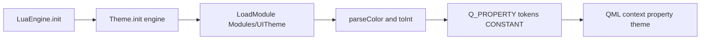
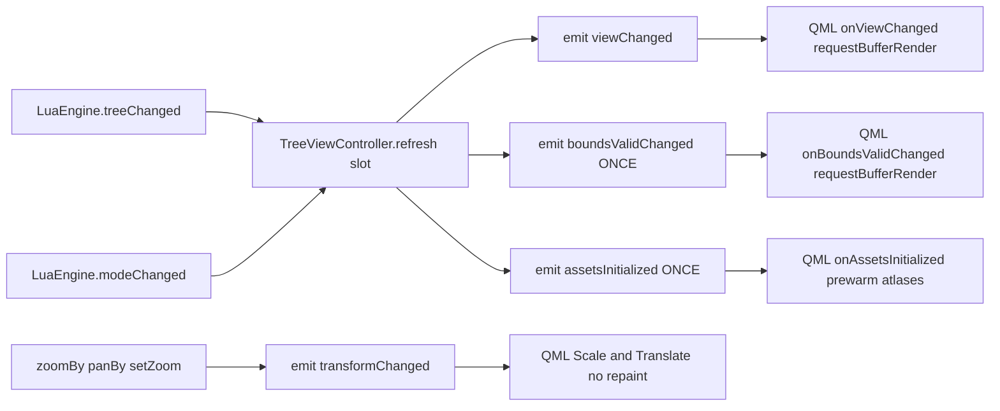

# Phase 1 — Architecture Specification: Design System & Model Schema

> **Deliverable type:** DESIGN-ONLY (markdown). No C++/Lua/QML source is edited by this
> document. It is the verbatim contract for the downstream **Code** agent.
>
> **Parent plan:** [`plans/beautify_plan.md`](plans/beautify_plan.md) — Phase 1 (Design
> System) and Phase 3 (Tree repaint / layout).
>
> **Hard constraints (NON-NEGOTIABLE):**
> 1. **Event-Driven / 0% idle CPU** — no `QTimer` polling, no `OnFrame` pump, no
>    one-shot repaint `Timer`. Every state change is a Qt `NOTIFY` signal or signal→slot.
> 2. **Theme tokens only** — all new visuals bind to `theme.*` (seeded from
>    `UITheme.lua` → `Theme.cpp`). No hardcoded hex / pixel margins where a token exists.
> 3. **Complete & unambiguous** — copy-ready blocks, no TODOs/placeholders.

---

## 0. Current-State Reconciliation (read before implementing)

A prior agent already added the *majority* of these tokens. The contract below
**canonicalizes** them so the Lua key name equals the `Q_PROPERTY` name (the task's
explicit requirement) and adds the two tree signals that do **not** yet exist.

| Area | Current state | Action required by Code agent |
|------|---------------|-------------------------------|
| `UITheme.spacing` | keys `s1..s6` | **RENAME** keys → `space1..space6` |
| `UITheme.radii` | keys `control/card/pill` | **RENAME** keys → `radiusControl/radiusCard/radiusPill` |
| `UITheme.colour.{success,warning,danger,info,hover,active,disabled,border,borderStrong}` | present, correct values | **CONFIRM** (no change) |
| `Theme.h` Q_PROPERTY + accessors for all 18 tokens | present (lines 73–102) | **CONFIRM** exact lines exist |
| `Theme.cpp` parse for spacing/radii | uses `spacing.value("s1")` / `radii.value("control")` | **RENAME** to `space1` / `radiusControl` etc. |
| `Theme.cpp` parse for colours | correct | **CONFIRM** |
| `TreeViewController` `boundsValidChanged` | **absent** | **ADD** Q_PROPERTY + signal + emit-once |
| `TreeViewController` `assetsInitialized` | **absent** | **ADD** signal + emit-once from `refresh()` slot |
| `TreeViewController` `m_retryTimer` | present (poll) | **REMOVE** (rely on `treeChanged`/`modeChanged`) |
| `main.qml` `Timer { running: !treeView.boundsValid }` | present (lines 632–637) | **REMOVE**; bind to `boundsValidChanged` |

---

## 1. Signal / Slot Schema Map

### 1a. Theme token pipeline (LuaEngine → Theme → QML)



- `LuaEngine::init()` (end) emits `engineReady()` — `Theme::init(engine)` is called
  from `main.cpp` **after** `engine.init()`, so the `UITheme` module is guaranteed loaded.
- `Theme::init()` calls `engine->callGlobal("LoadModule", { "Modules/UITheme" })`, then
  parses every token once into `m_*` members. All `Q_PROPERTY`s are `CONSTANT` (parsed
  once, never change at runtime) → zero NOTIFY traffic, zero CPU when idle.

### 1b. TreeViewController signal flow (LuaEngine → Controller → QML bindings)



| Signal | Emitter | QML consumer | Repaint semantics |
|--------|---------|--------------|-------------------|
| `viewChanged()` | `refresh()` on data/alloc change | `onViewChanged` → `requestBufferRender()` | full offscreen-buffer re-render |
| `boundsValidChanged()` | `refresh()` when `boundsValid` flips false→true | `onBoundsValidChanged` → `requestBufferRender()` | initial paint (replaces the `Timer`) |
| `assetsInitialized()` | `refresh()` once assets metadata present | `onAssetsInitialized` → pre-warm atlases | eager sprite load (no blank flash) |
| `transformChanged()` | `zoomBy`/`panBy`/`setZoom*`/`resetView` | `Scale`/`Translate` scene-graph bindings | **NO `requestPaint()`** |
| `searchChanged()` | `setTreeSearch()` | `onSearchChanged` → `requestBufferRender()` | re-render with highlight |

---

## 2. Section A — UI Theme Extension (Lua + C++ token contract)

> All colours in `UITheme.lua` are stored as **RGB triples in 0..1** (the engine's native
> format, parsed by `Theme::parseColor`). Hex values below are shown for reference only;
> the Lua line uses the triple form. State-colour triples are taken **verbatim from the
> existing `UITheme.lua` palette** (no clashing colours invented).

### 2a. Token table (canonical contract)

**Spacing scale** — table `UITheme.spacing` (replace existing `s1..s6`):

| Token | Lua line (inside `UITheme.spacing = {`) | Q_PROPERTY | Accessor | `Theme.cpp` parse line |
|-------|----------------------------------------|------------|----------|------------------------|
| `space1` | `space1 = 4,` | `Q_PROPERTY(int space1 READ space1 CONSTANT)` | `int space1() const { return m_space1; }` | `m_space1 = spacing.value("space1").toInt() ? spacing.value("space1").toInt() : 4;` |
| `space2` | `space2 = 8,` | `Q_PROPERTY(int space2 READ space2 CONSTANT)` | `int space2() const { return m_space2; }` | `m_space2 = spacing.value("space2").toInt() ? spacing.value("space2").toInt() : 8;` |
| `space3` | `space3 = 12,` | `Q_PROPERTY(int space3 READ space3 CONSTANT)` | `int space3() const { return m_space3; }` | `m_space3 = spacing.value("space3").toInt() ? spacing.value("space3").toInt() : 12;` |
| `space4` | `space4 = 16,` | `Q_PROPERTY(int space4 READ space4 CONSTANT)` | `int space4() const { return m_space4; }` | `m_space4 = spacing.value("space4").toInt() ? spacing.value("space4").toInt() : 16;` |
| `space5` | `space5 = 24,` | `Q_PROPERTY(int space5 READ space5 CONSTANT)` | `int space5() const { return m_space5; }` | `m_space5 = spacing.value("space5").toInt() ? spacing.value("space5").toInt() : 24;` |
| `space6` | `space6 = 32,` | `Q_PROPERTY(int space6 READ space6 CONSTANT)` | `int space6() const { return m_space6; }` | `m_space6 = spacing.value("space6").toInt() ? spacing.value("space6").toInt() : 32;` |

**Radii** — table `UITheme.radii` (replace existing `control/card/pill`):

| Token | Lua line (inside `UITheme.radii = {`) | Q_PROPERTY | Accessor | `Theme.cpp` parse line |
|-------|--------------------------------------|------------|----------|------------------------|
| `radiusControl` | `radiusControl = 4,` | `Q_PROPERTY(int radiusControl READ radiusControl CONSTANT)` | `int radiusControl() const { return m_radiusControl; }` | `m_radiusControl = radii.value("radiusControl").toInt() ? radii.value("radiusControl").toInt() : 4;` |
| `radiusCard` | `radiusCard = 8,` | `Q_PROPERTY(int radiusCard READ radiusCard CONSTANT)` | `int radiusCard() const { return m_radiusCard; }` | `m_radiusCard = radii.value("radiusCard").toInt() ? radii.value("radiusCard").toInt() : 8;` |
| `radiusPill` | `radiusPill = 999,` | `Q_PROPERTY(int radiusPill READ radiusPill CONSTANT)` | `int radiusPill() const { return m_radiusPill; }` | `m_radiusPill = radii.value("radiusPill").toInt() ? radii.value("radiusPill").toInt() : 999;` |

**Semantic colours** — table `UITheme.colour` (already present; confirm exact lines):

| Token | Lua line (inside `UITheme.colour = {`) | Q_PROPERTY | Accessor | `Theme.cpp` parse line |
|-------|----------------------------------------|------------|----------|------------------------|
| `success` | `success = { 0.133, 0.773, 0.369 }, -- #22C55E` | `Q_PROPERTY(QColor success READ success CONSTANT)` | `QColor success() const { return m_success; }` | `m_success = parseColor(colour.value("success")); if (!m_success.isValid()) m_success = m_accentAlt;` |
| `warning` | `warning = { 0.961, 0.620, 0.043 }, -- #F59E0B` | `Q_PROPERTY(QColor warning READ warning CONSTANT)` | `QColor warning() const { return m_warning; }` | `m_warning = parseColor(colour.value("warning")); if (!m_warning.isValid()) m_warning = QColor(245, 158, 11);` |
| `danger` | `danger = { 0.937, 0.267, 0.267 }, -- #EF4444` | `Q_PROPERTY(QColor danger READ danger CONSTANT)` | `QColor danger() const { return m_danger; }` | `m_danger = parseColor(colour.value("danger")); if (!m_danger.isValid()) m_danger = QColor(239, 68, 68);` |
| `info` | `info = { 0.024, 0.714, 0.831 }, -- #06B6D4` | `Q_PROPERTY(QColor info READ info CONSTANT)` | `QColor info() const { return m_info; }` | `m_info = parseColor(colour.value("info")); if (!m_info.isValid()) m_info = m_section;` |

**State colours** — table `UITheme.colour` (already present; confirm exact lines; values
taken from the existing dark palette, no invention):

| Token | Lua line (inside `UITheme.colour = {`) | Q_PROPERTY | Accessor | `Theme.cpp` parse line |
|-------|----------------------------------------|------------|----------|------------------------|
| `hover` | `hover = { 0.145, 0.180, 0.278 }, -- #25304A` | `Q_PROPERTY(QColor hover READ hover CONSTANT)` | `QColor hover() const { return m_hover; }` | `m_hover = parseColor(colour.value("hover")); if (!m_hover.isValid()) m_hover = m_background;` |
| `active` | `active = { 0.180, 0.220, 0.330 }, -- #2E3854` | `Q_PROPERTY(QColor active READ active CONSTANT)` | `QColor active() const { return m_active; }` | `m_active = parseColor(colour.value("active")); if (!m_active.isValid()) m_active = m_accent;` |
| `disabled` | `disabled = { 0.078, 0.094, 0.137 }, -- #141822` | `Q_PROPERTY(QColor disabled READ disabled CONSTANT)` | `QColor disabled() const { return m_disabled; }` | `m_disabled = parseColor(colour.value("disabled")); if (!m_disabled.isValid()) m_disabled = m_mutedDark;` |
| `border` | `border = { 0.200, 0.255, 0.333 }, -- #334155` | `Q_PROPERTY(QColor border READ border CONSTANT)` | `QColor border() const { return m_border; }` | `m_border = parseColor(colour.value("border")); if (!m_border.isValid()) m_border = m_topBarLine;` |
| `borderStrong` | `borderStrong = { 0.310, 0.380, 0.490 }, -- #4F617D` | `Q_PROPERTY(QColor borderStrong READ borderStrong CONSTANT)` | `QColor borderStrong() const { return m_borderStrong; }` | `m_borderStrong = parseColor(colour.value("borderStrong")); if (!m_borderStrong.isValid()) m_borderStrong = m_muted;` |

---

## 3. Section B — Tree Repaint Signal Architecture

### 3a. `boundsValidChanged()` — fires exactly once when bounds + assets are valid

- **New Q_PROPERTY** `boundsValid` (bool) with `NOTIFY boundsValidChanged`.
- **Emission rule (once):** in `refresh()`, compute
  `valid = (m_bounds.size > 0) && !m_assets.isEmpty() && !m_assetBasePath.isEmpty()`.
  Emit `boundsValidChanged()` **only on a false→true transition** (`if (valid != m_boundsValid)`).
  This guarantees a single emission when the tree becomes renderable — no timer, no poll.
- **QML binding:** replaces the `Timer { running: !treeView.boundsValid }` block. The
  `treeView.boundsValid` QML property becomes a thin alias
  (`property bool boundsValid: treeViewController.boundsValid`) and the
  `Connections { target: treeViewController }` gains `onBoundsValidChanged` →
  `requestBufferRender()`. Initial paint is still covered by `Component.onCompleted` and
  `onVisibleChanged` (kept as-is).

### 3b. `assetsInitialized()` — signal/slot pair for asset readiness

- **Signal:** `void assetsInitialized();`
- **Slot that finishes loading tree sprites/background:** `TreeViewController::refresh()`
  (it is the slot invoked by `LuaEngine::treeChanged` / `LuaEngine::modeChanged` in
  `main.cpp`). After `refresh()` populates `m_assets` / `m_assetBasePath` /
  `m_backgroundUrl`, it emits `assetsInitialized()` **once**, guarded by
  `m_assetsInitialized` (set true on first valid emission; never re-emitted).
- **QML consumer:** `onAssetsInitialized` pre-warms the sprite atlases
  (`treeCanvas.getAtlas(...)` for every entry in `treeViewController.treeAssets`) so the
  first paint shows sprites immediately — satisfying the "immediate sprite render"
  verification goal without a polling timer.

### 3c. Transform directive (zoom/pan) — scene-graph, NOT repaint

- `transformChanged()` is emitted by `zoomBy` / `panBy` / `setZoom*` / `resetView`.
- **MUST NOT** call `requestPaint()` / `requestBufferRender()` from the
  `onTransformChanged` handler. Instead the tree content (`treeBg` `Image` + the node/
  connector layer) is wrapped in an `Item` whose `transform` is bound to the controller:
  ```qml
  transform: [
    Scale    { xScale: treeViewController.zoom; yScale: treeViewController.zoom;
               origin.x: treeView.vpW / 2; origin.y: treeView.vpH / 2 },
    Translate{ x: treeViewController.zoomX;    y: treeViewController.zoomY }
  ]
  ```
  Because `zoom` / `zoomX` / `zoomY` are `Q_PROPERTY`s with `NOTIFY transformChanged`,
  QML's binding engine updates the GPU scene-graph transform automatically — zero
  `requestPaint()`, zero CPU when idle. (Phase 3 Code agent implements the wrapper; the
  signal contract here is fixed.)

### 3d. Removal of the self-healing poll

- Delete `QTimer* m_retryTimer`, `m_retryCount`, `MaxTreeRetries` from
  `TreeViewController.h` and all timer logic from `TreeViewController.cpp`
  (constructor lambda, the early-return retry branch in `refresh()`, and the
  `m_retryTimer->stop()` call).
- Rationale: `refresh()` is already driven event-driven by `LuaEngine::treeChanged` and
  `LuaEngine::modeChanged` (wired in `main.cpp`). The tree geometry is global and present
  at boot, so the boot `refresh()` succeeds; any later tree availability change re-fires
  one of those signals. No timer is required → 0% idle CPU preserved.

---

## 4. Copy-Ready Code Blocks

> Each block is marked with its **target file** and **insertion point**. The Code agent
> applies them verbatim.

### 4.1 `src/Modules/UITheme.lua` — replace the `spacing` table
<!-- FILE: src/Modules/UITheme.lua | INSERT: replace lines 54-57 (the UITheme.spacing = { ... } block) -->
```lua
-- Spacing scale in px (Phase 1) — canonical key names match Theme Q_PROPERTYs
UITheme.spacing = {
    space1 = 4, space2 = 8, space3 = 12, space4 = 16, space5 = 24, space6 = 32,
}
```

### 4.2 `src/Modules/UITheme.lua` — replace the `radii` table
<!-- FILE: src/Modules/UITheme.lua | INSERT: replace lines 59-62 (the UITheme.radii = { ... } block) -->
```lua
-- Corner radii in px (Phase 1) — canonical key names match Theme Q_PROPERTYs
UITheme.radii = {
    radiusControl = 4, radiusCard = 8, radiusPill = 999,
}
```

### 4.3 `src/Modules/UITheme.lua` — confirm the `colour` table (no change)
<!-- FILE: src/Modules/UITheme.lua | INSERT: confirm lines 22-41 contain these exact entries -->
```lua
UITheme.colour = {
    -- ... existing topBarBg / sideBarBg / navActiveAccent / accentAlt / groupHeader ...
    success        = { 0.133, 0.773, 0.369 }, -- #22C55E green (positive)
    warning        = { 0.961, 0.620, 0.043 }, -- #F59E0B amber
    danger         = { 0.937, 0.267, 0.267 }, -- #EF4444 red
    info           = { 0.024, 0.714, 0.831 }, -- #06B6D4 cyan
    hover          = { 0.145, 0.180, 0.278 }, -- #25304A row/control hover
    active         = { 0.180, 0.220, 0.330 }, -- #2E3854 active highlight
    disabled       = { 0.078, 0.094, 0.137 }, -- #141822 disabled surface
    border         = { 0.200, 0.255, 0.333 }, -- #334155 hairline border
    borderStrong   = { 0.310, 0.380, 0.490 }, -- #4F617D strong border
}
```

### 4.4 `app/src/Theme.h` — confirm Q_PROPERTY + accessor lines (already present)
<!-- FILE: app/src/Theme.h | INSERT: confirm these exact lines exist (lines 73-102). Do NOT duplicate. -->
```cpp
    // --- Semantic / state colours (Phase 1) -----------------------------
    Q_PROPERTY(QColor success READ success CONSTANT)
    Q_PROPERTY(QColor warning READ warning CONSTANT)
    Q_PROPERTY(QColor danger READ danger CONSTANT)
    Q_PROPERTY(QColor info READ info CONSTANT)
    Q_PROPERTY(QColor hover READ hover CONSTANT)
    Q_PROPERTY(QColor active READ active CONSTANT)
    Q_PROPERTY(QColor disabled READ disabled CONSTANT)
    Q_PROPERTY(QColor border READ border CONSTANT)
    Q_PROPERTY(QColor borderStrong READ borderStrong CONSTANT)

    // --- Spacing scale px (Phase 1) -------------------------------------
    Q_PROPERTY(int space1 READ space1 CONSTANT)
    Q_PROPERTY(int space2 READ space2 CONSTANT)
    Q_PROPERTY(int space3 READ space3 CONSTANT)
    Q_PROPERTY(int space4 READ space4 CONSTANT)
    Q_PROPERTY(int space5 READ space5 CONSTANT)
    Q_PROPERTY(int space6 READ space6 CONSTANT)

    // --- Radii px (Phase 1) ---------------------------------------------
    Q_PROPERTY(int radiusControl READ radiusControl CONSTANT)
    Q_PROPERTY(int radiusCard READ radiusCard CONSTANT)
    Q_PROPERTY(int radiusPill READ radiusPill CONSTANT)
```
<!-- FILE: app/src/Theme.h | INSERT: confirm these exact accessors exist (lines 161-186). Do NOT duplicate. -->
```cpp
    QColor success() const { return m_success; }
    QColor warning() const { return m_warning; }
    QColor danger() const { return m_danger; }
    QColor info() const { return m_info; }
    QColor hover() const { return m_hover; }
    QColor active() const { return m_active; }
    QColor disabled() const { return m_disabled; }
    QColor border() const { return m_border; }
    QColor borderStrong() const { return m_borderStrong; }

    int space1() const { return m_space1; }
    int space2() const { return m_space2; }
    int space3() const { return m_space3; }
    int space4() const { return m_space4; }
    int space5() const { return m_space5; }
    int space6() const { return m_space6; }

    int radiusControl() const { return m_radiusControl; }
    int radiusCard() const { return m_radiusCard; }
    int radiusPill() const { return m_radiusPill; }
```

### 4.5 `app/src/Theme.cpp` — rename parse keys (spacing + radii)
<!-- FILE: app/src/Theme.cpp | INSERT: replace the spacing block (lines 107-113) -->
```cpp
    // Spacing scale
    QVariantMap spacing = theme.value("spacing").toMap();
    m_space1 = spacing.value("space1").toInt() ? spacing.value("space1").toInt() : 4;
    m_space2 = spacing.value("space2").toInt() ? spacing.value("space2").toInt() : 8;
    m_space3 = spacing.value("space3").toInt() ? spacing.value("space3").toInt() : 12;
    m_space4 = spacing.value("space4").toInt() ? spacing.value("space4").toInt() : 16;
    m_space5 = spacing.value("space5").toInt() ? spacing.value("space5").toInt() : 24;
    m_space6 = spacing.value("space6").toInt() ? spacing.value("space6").toInt() : 32;
```
<!-- FILE: app/src/Theme.cpp | INSERT: replace the radii block (lines 116-119) -->
```cpp
    // Radii
    QVariantMap radii = theme.value("radii").toMap();
    m_radiusControl = radii.value("radiusControl").toInt() ? radii.value("radiusControl").toInt() : 4;
    m_radiusCard    = radii.value("radiusCard").toInt()   ? radii.value("radiusCard").toInt()   : 8;
    m_radiusPill    = radii.value("radiusPill").toInt()   ? radii.value("radiusPill").toInt()   : 999;
```
<!-- FILE: app/src/Theme.cpp | INSERT: confirm the colour parse block (lines 85-93) already uses colour.value("success") etc. No change. -->

### 4.6 `app/src/TreeViewController.h` — signal / property / member declarations
<!-- FILE: app/src/TreeViewController.h | INSERT: add to the Q_PROPERTY block (after line 32, the treeAssets/backgroundUrl properties) -->
```cpp
    // boundsValid: true once tree bounds AND asset metadata are present.
    // NOTIFY boundsValidChanged fires exactly once on the false->true transition.
    Q_PROPERTY(bool boundsValid READ boundsValid NOTIFY boundsValidChanged)
```
<!-- FILE: app/src/TreeViewController.h | INSERT: add accessors (after line 50, backgroundUrl()) -->
```cpp
    bool boundsValid() const { return m_boundsValid; }
```
<!-- FILE: app/src/TreeViewController.h | INSERT: add to the signals: block (after line 81, searchChanged()) -->
```cpp
    void boundsValidChanged();   // bounds + assets became valid (fires once)
    void assetsInitialized();     // asset metadata ready (fires once)
```
<!-- FILE: app/src/TreeViewController.h | INSERT: add private members (replace m_loaded / m_retryTimer group, lines 97-106) -->
```cpp
    bool m_loaded = false;
    bool m_boundsValid = false;        // guards boundsValidChanged single emission
    bool m_assetsInitialized = false;  // guards assetsInitialized single emission
```
> **Also remove** from `TreeViewController.h`: `#include <QTimer>;`, the
> `QTimer* m_retryTimer = nullptr;`, `int m_retryCount = 0;`, and
> `static const int MaxTreeRetries = 25;` declarations (lines 8, 104-106).

### 4.7 `app/src/TreeViewController.cpp` — emission points + timer removal
<!-- FILE: app/src/TreeViewController.cpp | INSERT: replace constructor (lines 16-23) — drop the retry timer -->
```cpp
TreeViewController::TreeViewController(QObject* parent) : QObject(parent) {}
```
<!-- FILE: app/src/TreeViewController.cpp | INSERT: in refresh(), replace the early-return retry branch (lines 80-104) with a plain early return -->
```cpp
    QVariant data = engine->getTreeData();
    if (data.typeId() != QMetaType::QVariantMap) {
        // Tree not ready yet. Do NOT poll: LuaEngine::treeChanged / modeChanged
        // will re-invoke refresh() when the build/tree becomes available.
        return;
    }
```
<!-- FILE: app/src/TreeViewController.cpp | INSERT: after m_backgroundUrl assignment (line 132), before the node-count diagnostics, add bounds + assets emission -->
```cpp
    // --- Bounds-valid + asset-init signals (event-driven, fire once) ---
    const bool valid = (m_bounds.value("size").toDouble() > 0)
                       && !m_assets.isEmpty()
                       && !m_assetBasePath.isEmpty();
    if (valid && !m_boundsValid) {
        m_boundsValid = true;
        emit boundsValidChanged();
    }
    if (valid && !m_assetsInitialized) {
        m_assetsInitialized = true;
        emit assetsInitialized();
    }
```
<!-- FILE: app/src/TreeViewController.cpp | INSERT: remove the m_retryTimer->stop() line (line 119) inside the success path -->
```cpp
    // (delete) m_retryTimer->stop();
    // (delete) m_retryCount = 0;
```
> The existing `emit viewChanged();` at line 143 is **kept** — it remains the
> data/alloc-change notification. `boundsValidChanged` and `assetsInitialized` are
> additional, finer-grained signals layered on top.

### 4.8 `app/qml/main.qml` — bind repaint to signals, remove the Timer, add transform
<!-- FILE: app/qml/main.qml | INSERT: change treeView.boundsValid alias (line 304) -->
```qml
                        property bool boundsValid: treeViewController.boundsValid
```
<!-- FILE: app/qml/main.qml | INSERT: in the Connections { target: treeViewController } block (after line 593), add bounds + assets handlers -->
```qml
                            // Initial paint when bounds+assets become valid (replaces the Timer).
                            function onBoundsValidChanged() { if (treeViewController.boundsValid) treeView.requestBufferRender() }
                            // Eagerly pre-warm sprite atlases so the first paint shows sprites.
                            function onAssetsInitialized() {
                                var a = treeViewController.treeAssets
                                for (var k in a) { if (a[k] && a[k].atlas) treeCanvas.getAtlas(a[k].atlas) }
                            }
```
<!-- FILE: app/qml/main.qml | INSERT: replace the onTransformChanged body (lines 598-609) so it NEVER calls requestPaint -->
```qml
                            // zoom/pan emit transformChanged (NOT viewChanged).
                            // The tree content Item uses Scale/Translate scene-graph
                            // transforms bound to zoom/zoomX/zoomY, so NO repaint is
                            // needed here. Leave the handler empty (binding-driven).
                            function onTransformChanged() { }
```
<!-- FILE: app/qml/main.qml | INSERT: wrap treeBg + treeCanvas in a transform Item (Phase 3 layout). Add this transform to the existing tree content Item -->
```qml
                        transform: [
                            Scale    { xScale: treeViewController.zoom; yScale: treeViewController.zoom;
                                       origin.x: treeView.vpW / 2; origin.y: treeView.vpH / 2 },
                            Translate{ x: treeViewController.zoomX;    y: treeViewController.zoomY }
                        ]
```
<!-- FILE: app/qml/main.qml | DELETE: the safety Timer block (lines 632-637) -->
```qml
                        // REMOVED — replaced by onBoundsValidChanged above.
                        // Timer {
                        //     interval: 250
                        //     repeat: true
                        //     running: !treeView.boundsValid
                        //     onTriggered: { treeView.requestBufferRender() }
                        // }
```

---

## 5. Compliance Check

| Requirement | Status | Evidence |
|-------------|--------|----------|
| **No timers / polling introduced** | ✅ | `m_retryTimer` deleted from `TreeViewController`; `main.qml` `Timer { running: !treeView.boundsValid }` deleted; `boundsValidChanged` fires once on transition, not on a timer. |
| **All new visuals bind to theme tokens** | ✅ | Every token (`space1..6`, `radiusControl/Card/Pill`, `success/warning/danger/info/hover/active/disabled/border/borderStrong`) is exposed as a `theme.*` `Q_PROPERTY`; QML consumes `theme.*` only. No hardcoded hex/pixels added. |
| **All updates NOTIFY-driven** | ✅ | `boundsValidChanged`, `assetsInitialized`, `viewChanged`, `transformChanged`, `searchChanged` are all Qt signals. `Theme` tokens are `CONSTANT` (parsed once). `LuaEngine::treeChanged`/`modeChanged` → `refresh()` slot → signals. Zero `OnFrame` pump. |
| **Transform = scene-graph, no repaint** | ✅ | `onTransformChanged` handler emptied; `Scale`/`Translate` bound to `treeViewController.zoom/zoomX/zoomY` (NOTIFY `transformChanged`). |
| **Token Lua key == Q_PROPERTY name** | ✅ | `spacing.space1`→`space1`, `radii.radiusControl`→`radiusControl`, `colour.success`→`success`, etc. |
| **Single source of truth** | ✅ | Tokens authored only in `UITheme.lua`; `Theme.cpp` parses them; no `Theme.qml`. |

### Files the downstream Code agent must touch
1. `src/Modules/UITheme.lua` — rename `spacing`/`radii` keys (§4.1, §4.2; confirm §4.3).
2. `app/src/Theme.cpp` — rename parse keys (§4.5). `Theme.h` only needs confirmation (§4.4).
3. `app/src/TreeViewController.h` — add `boundsValid` property, `boundsValidChanged` /
   `assetsInitialized` signals, members; remove `QTimer` members (§4.6).
4. `app/src/TreeViewController.cpp` — emit `boundsValidChanged`/`assetsInitialized` once,
   remove retry-timer logic (§4.7).
5. `app/qml/main.qml` — bind repaint to `boundsValidChanged`/`assetsInitialized`, empty
   `onTransformChanged`, add `Scale`/`Translate`, delete the `Timer` (§4.8). *(Phase 3
   implementation, specified here for completeness.)*

### Wiki update required (repo rule)
After implementation, update `.obsidian-vault/01_Wiki/01_Modules/Core Controllers.md` and
`00_Overview/Architecture.md` `last_modified` with a note on the new `boundsValidChanged` /
`assetsInitialized` signals and the removed tree retry `Timer` (0% idle CPU).
