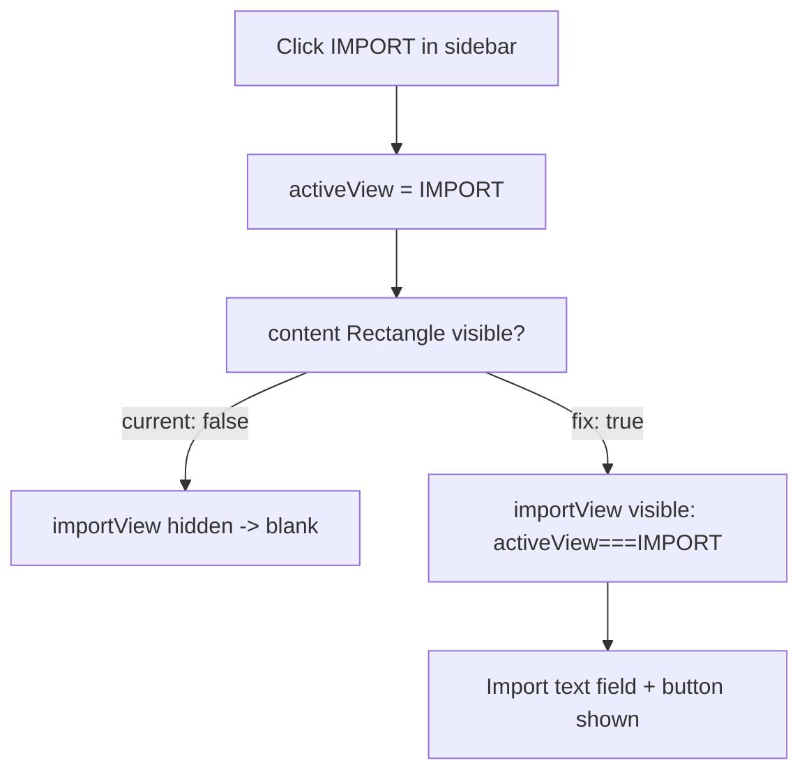
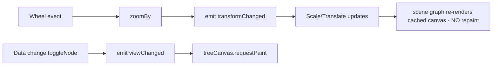

# Style Spike Plan — Cyber Citrus UI Fixes

## Goal
Fix the five reported UI defects in the Qt/QML port (`app/qml/main.qml`, `app/src/Theme.*`,
`app/src/TreeViewController.*`, `src/Modules/UITheme.lua`) and apply the **Cyber Citrus**
high-contrast tech color scheme.

## Color Scheme: Cyber Citrus
| Role | Hex | RGB triple (0..1) | Mapped theme prop |
|------|-----|-------------------|-------------------|
| Background / Primary | `#0F172A` | `0.059, 0.090, 0.165` | `sideBarBg`, `topBarBg`, `background` |
| Electric Accent (lime) | `#22C55E` | `0.133, 0.773, 0.369` | `navActiveAccent`, `accent` |
| Secondary Action (cyan) | `#06B6D4` | `0.024, 0.714, 0.831` | `groupHeader`, `section` |
| Text / Base | `#FFFFFF` | `1, 1, 1` | `text` (Theme default) |
| Muted text | `#94A3B8` | `0.580, 0.639, 0.722` | `muted` (Theme default) |
| Lines | `#334155` | `0.200, 0.255, 0.333` | `topBarLine`, `sideBarLine` |

## Defects & Fixes

### 1. Color scheme (Cyber Citrus)
- Edit [`src/Modules/UITheme.lua`](src/Modules/UITheme.lua:23) `colour` table → set the 6 RGB triples above.
- Edit [`app/src/Theme.cpp`](app/src/Theme.cpp:72) UI defaults: `m_text = #FFFFFF`, `m_muted = #94A3B8`, `m_mutedDark = #64748B`.
- Secondary-action buttons already map to `theme.section` (cyan) — verify they read well on `#0F172A`.

### 2. No way to import (utility views unreachable)
Root cause: the content `Rectangle` at [`app/qml/main.qml`](app/qml/main.qml:225) has
`visible: activeView !== "NOTES" && ... && activeView !== "IMPORT" ...`. The IMPORT/NOTES/
COMPARE/PARTY views are **children** of that Rectangle, so when you switch to them the parent
hides and the views never show.
Fix: make the content `Rectangle` always visible (`visible: true`); each child view already
toggles itself via `visible: activeView === "X"`.

### 3. Text on top of text
Two likely causes:
- (a) Nav-button labels overflow their fixed-width `Rectangle` (width 72/58, non-elided `Text`)
  and overlap neighbors. Fix: add `clip: true` + `elide: Text.ElideRight` to the nav label
  `Text`, and/or let button width grow to content.
- (b) Top-bar build-metadata `Text` elements can overflow on narrow windows. Fix: `elide` the
  build-name `Text` and confirm `RowLayout` spacing.
Audit both spots in [`app/qml/main.qml`](app/qml/main.qml:188) (sidebar) and
[`app/qml/main.qml`](app/qml/main.qml:133) (top bar).

### 4. Extremely slow / laggy tree zoom
Root cause: every wheel tick calls `treeViewController.zoomBy()` → emits `viewChanged()` →
QML [`onViewChanged`](app/qml/main.qml:389) calls `treeCanvas.requestPaint()`, which redraws
**all ~1500 nodes + connectors** synchronously. But `treeRoot` already applies a `Scale`+`Translate`
transform bound to `zoom`/`zoomX`/`zoomY`, so zoom/pan is already handled visually — the repaint
is redundant and is what causes the lag.
Fix:
- In [`app/src/TreeViewController.cpp`](app/src/TreeViewController.cpp:23) split signals:
  `transformChanged()` (emitted by `setZoomLevel`/`setZoomX`/`setZoomY`/`panBy`/`resetView`)
  and keep `viewChanged()` only for data/allocation changes (`refresh`, `toggleNode`).
- In QML, repaint only on `onViewChanged` (data). Do **not** repaint on `transformChanged`
  (the bound `Scale`/`Translate` re-renders the cached canvas automatically).

### 5. Assets aren't there (tree art missing)
The tree currently draws placeholder circles. `TreeViewController` already loads
`m_assets` + `m_assetBasePath` ([`app/src/TreeViewController.cpp`](app/src/TreeViewController.cpp:88))
from the engine but they are never exposed to QML. Real sprite files exist under
`src/.../3_28/background-3.png`, `line-3.png`, `mastery-3.png`, etc.
Fix (spike scope):
- Expose `assetBasePath` and a node→sprite resolver to QML (new `Q_INVOKABLE` on
  `TreeViewController`, e.g. `spriteUrl(type, state)`).
- Render the **background image** as an `Image` behind nodes (biggest visual win).
- Render node **frames** via Canvas `ctx.drawImage(sprite, x, y)` (or `Image` per node) using
  the resolved sprite, replacing the circle placeholders. Keep the canvas as the draw surface so
  the zoom/transform fix above still applies.
- Inspect the exact `m_assets` map shape during implementation (it is already populated by the
  engine bridge) to map node type/state → filename.

## Execution Order
1. Color scheme (UITheme.lua + Theme.cpp)
2. Import/utility view visibility fix
3. Text-overlap audit + fixes (nav labels, top bar)
4. Zoom performance fix (signal split + QML repaint change)
5. Tree asset wiring (background + node sprites)
6. Build & smoke test (`build-win/pob-qt.exe`)

## Verification
- Launch `build-win/pob-qt.exe`; confirm Cyber Citrus palette, import view reachable with visible
  text, no overlapping text, smooth wheel-zoom, and tree shows real background + node art.
- Update the relevant `.obsidian-vault/01_Wiki/` note's `last_modified` after code changes.
