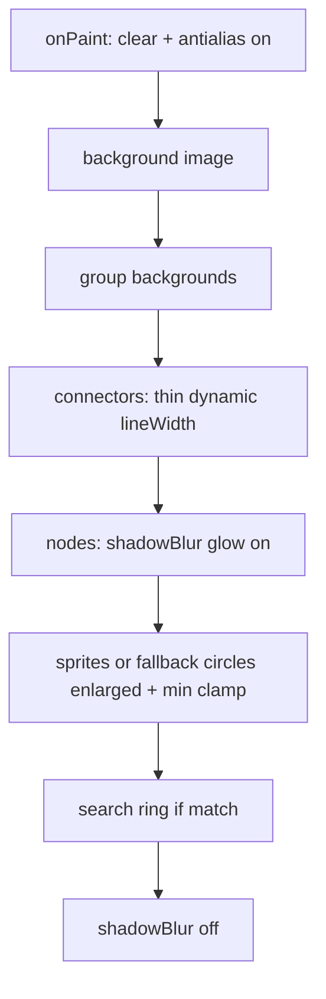

# Tree Node & Asset Visibility — Rendering Plan

> Goal: rework the passive-tree renderer in the Qt/QML port so loaded node
> assets are the focal point (larger nodes, thinner guides, glow), while
> staying legible at every zoom level.
>
> Scope (confirmed): **`app/qml/main.qml` only** — the `Canvas` (`treeCanvas`)
> renderer. The legacy Lua `PassiveTreeView.lua` is out of scope.
> Glow color: **`theme.accent` (lime #22C55E)**.

## Current state (references)

- Renderer: [`app/qml/main.qml`](app/qml/main.qml:334) `onPaint` draws in
  **screen space** via `sx(x)/sy(y)` using `scale = treeView.scale`
  (`baseScale * zoom`, line 340). `treeRoot` (line 293) holds the `Scale`/
  `Translate` transform but the canvas itself paints in screen coords.
- `zoom = 1.2^zoomLevel` (level 0–12, default 3) from
  [`TreeViewController.cpp`](app/src/TreeViewController.cpp:32);
  `bounds.size` ≈ 26000 → `scale` ≈ 0.04 (out) … 0.34 (in).
- Node sprites: `dw = sp.sw * scale` (line 420) → ≈7px at default zoom
  (assets too small). Fallback circles use **fixed** radii 5/7/9/6/7
  (line 437) that ignore zoom.
- Connectors: `ctx.lineWidth = 2` constant (line 388), drawn **before** nodes
  (line 386 before 403) → correct z-order.
- No `shadowBlur`/glow, no explicit antialiasing.

## Changes

### 1. Tunable visual constants (add to the `treeView` Item, ~line 291)
```qml
// --- Tree visual tuning: asset-visibility pass ---
property real nodeScaleFactor: 1.8   // enlarge node bbox vs native sprite
property real minNodePx: 16          // legible min on-screen node size when zoomed out
property real baseConnWidth: 0.75    // drastically reduced base stroke width
property real connMinWidth: 0.5
property real connMaxWidth: 1.5
property real connScaleK: 11.0       // lineWidth = clamp(scale*K, min, max)
property real nodeGlowBlur: 8
property color nodeGlowColor: theme.accent
```

### 2. Antialiasing + crisp asset scaling (top of `onPaint`, line 335)
```js
var ctx = getContext("2d", { antialias: true })
ctx.imageSmoothingEnabled = true
ctx.imageSmoothingQuality = "high"
```

### 3. Node & asset scaling (dynamic + minimum clamp)
Replace the sprite draw (lines 419–422) and fallback circle (437–447) so both
derive from a single enlarged, zoom-scaled, clamped node size:
```js
var nodeScale = scale * treeView.nodeScaleFactor
// sprite (preserve aspect ratio)
var dw = Math.max(treeView.minNodePx, sp.sw * nodeScale)
var dh = dw * (sp.sh / sp.sw)
ctx.drawImage(img, sp.sx, sp.sy, sp.sw, sp.sh, px - dw/2, py - dh/2, dw, dh)
// fallback circle (enlarged base radii, scaled + clamped)
var baseR = 9
if (n.type === "Notable") baseR = 13
else if (n.type === "Keystone") baseR = 17
else if (n.isJewelSocket) baseR = 11
else if (n.isMastery) baseR = 13
var r = Math.max(treeView.minNodePx / 2, baseR * nodeScale)
```
The search-highlight ring already uses `Math.max(dw, dh)/2 + 3` (line 427) so
it scales automatically with the larger nodes.

### 4. Connector restyle (thin + dynamic + z-order preserved)
Replace `ctx.lineWidth = 2` (line 388) with a zoom-scaled, clamped width so
lines stay subtle at every zoom:
```js
ctx.lineWidth = Math.max(treeView.connMinWidth,
                         Math.min(treeView.connMaxWidth, scale * treeView.connScaleK))
```
Draw order is already correct (background → group bg → connectors → nodes);
keep it and add an explicit comment. No structural reordering needed.

### 5. Subtle outer glow on nodes
Set `shadowBlur`/`shadowColor` at the start of the node `try` block (line 405)
and reset to `0` at the end (line 450) so the glow applies only to nodes/assets
(and the search ring), never to connectors/background:
```js
ctx.shadowBlur = treeView.nodeGlowBlur
ctx.shadowColor = treeView.nodeGlowColor
... node drawing ...
ctx.shadowBlur = 0
```
> Perf note: the 250ms safety `Timer` (line 541) repaints continuously, so the
> glow cost is paid ~4×/sec for ~1500 nodes. `nodeGlowBlur = 8` is modest; if
> frame drops appear, either lower the blur or gate the timer. Left as a tunable.

### 6. Draw-order verification
Confirm and comment the strict back-to-front order inside `onPaint`:
`background image → group backgrounds → connectors → nodes/assets`. This
guarantees paths never overlap or clip the images.

## Scaling formulas (summary)
```
scale        = min(vpW,vpH)/bounds.size * zoom          // from treeView.scale
nodeScale    = scale * nodeScaleFactor
sprite size  = max(minNodePx, sp.sw * nodeScale)  x aspect
circle r     = max(minNodePx/2, baseR * nodeScale)
conn width   = clamp(scale * connScaleK, connMin, connMax)
```

## Draw pipeline (mermaid)


## Verification
- Build + install: `ninja && cmake --install build-win --prefix <repo_root>`
  (deploy-gate from `plans/style_fix_pass2.md` — required or changes won't show).
- Launch `build-win/pob-qt.exe`; open TREE view.
- Check: assets are clearly larger / focal; connectors are thin subtle guides
  behind nodes; glow makes assets pop on dark bg; zooming out keeps nodes
  legible (min clamp) and lines fine; zooming in keeps lines from dominating.
- Screenshot-diff vs prior `captures/tree.png` if available.

## Wiki update (repo rule)
- Update `.obsidian-vault/01_Wiki/01_Modules/Core Controllers.md` (tree
  rendering section) `last_modified` + note the QML Canvas tuning constants.
