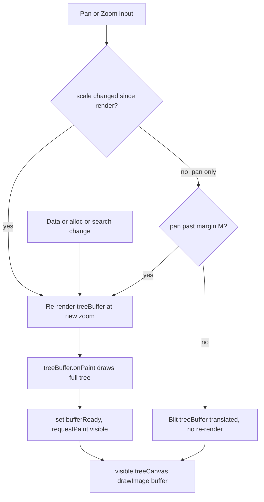

# Tree Offscreen Render-Cache Plan

## Goal
Match legacy passive-tree pan smoothness: render the tree **once** into an offscreen
`Canvas` (`treeBuffer`) at the current zoom, then **blit (translate) the cached bitmap**
during pan instead of re-drawing ~6000 primitives per pan delta. Re-render the buffer
only on **zoom change** or **data/alloc/search change**. Also drop
`imageSmoothingQuality` from `"high"` to `"medium"` to speed sprite scaling on re-render.

This resolves the flagged future task in [`plans/tree_regression_fix.md`](plans/tree_regression_fix.md:32).

## Current state (why pan lags)
- [`app/qml/main.qml`](app/qml/main.qml:323) `treeCanvas` is a viewport-sized `Canvas`.
  Its `onPaint` redraws the **entire** tree every repaint: background, group backgrounds,
  ~3000 connectors, ~3000 nodes — all in screen space.
- `panBy`/`zoomBy` emit `transformChanged` → `onTransformChanged` calls
  `treeCanvas.requestPaint()` ([`main.qml:550`](app/qml/main.qml:550)). So **every pan
  delta triggers a full ~6000-call re-render** — the source of lag.
- `imageSmoothingQuality = "high"` is set at [`main.qml:345`](app/qml/main.qml:345) and
  applies to every sprite `drawImage` (scaling) on every repaint.
- The `treeRoot` `Item` with `Scale`/`Translate` ([`main.qml:301`](app/qml/main.qml:301))
  has **no children** and does nothing — dead code to be removed.

## Chosen approach (confirmed with user)
**Offscreen `Canvas` + `drawImage` blit.**
- A hidden `treeBuffer` `Canvas` renders the full tree at the current zoom into a buffer
  sized `viewport + 2*M` (M = pan margin, default 512px).
- The visible `treeCanvas.onPaint` just `drawImage(treeBuffer, blitX, blitY)` (1:1 copy,
  `imageSmoothingEnabled=false`) — a cheap GPU/CPU blit, no primitive redraw.
- Pan updates `blitX/blitY` only. When pan exceeds margin M, the buffer is re-centered and
  re-rendered. Zoom/data change forces a re-render.

## Coordinate math
Screen mapping today: `ox = width/2 + zoomX`, `sx(x) = ox + scale*x`
([`main.qml:352-355`](app/qml/main.qml:352)). World center shown at screen center is
`C = (-zoomX/scale, -zoomY/scale)`.

Buffer is rendered with the **same** `zoomX/zoomY/scale` but centered in its own larger
surface, so buffer-center == world center C. Blit base offset to align buffer-center with
viewport-center is `(-M, -M)` (since `bufW = vpW + 2M`).

During pan, `zoomX`/`zoomY` change by `Δ`. Blit offset:
```
blitX = -M + (zoomX_current - zoomX_render)
blitY = -M + (zoomY_current - zoomY_render)
```
Re-render buffer (reset `zoomX_render/zoomY_render = current`, blit back to `-M`) when:
- `scale` changed since last render (zoom), OR
- `|zoomX_current - zoomX_render| > M` or `|zoomY_current - zoomY_render| > M` (pan past margin), OR
- data/alloc/search/bounds/atlas/model-count changed.

## Render flow



## Steps (actionable, in order)

1. **Verify offscreen `Canvas` paint behavior.** Confirm a `visible:false` (preferred,
   zero composite cost) or `opacity:0` `Canvas` populates its backing store so
   `drawImage(treeBuffer, ...)` reads valid pixels. If `visible:false` does not paint,
   use `visible:true; opacity:0`. Fallback if backing store is inaccessible: switch to
   `ShaderEffectSource` (live:false) capturing a render `Item`.
2. **Refactor draw logic into a shared JS function** `drawTree(ctx, w, h, zoomX, zoomY, scale)`
   containing the current background → groups → connectors → nodes block
   ([`main.qml:356-474`](app/qml/main.qml:356)). Preserve all visual tuning
   (`nodeScaleFactor`, `minNodePx`, connector widths, search highlight, alloc colors).
   Set `imageSmoothingQuality = "medium"` and `imageSmoothingEnabled = true` inside it.
3. **Add `treeBuffer` `Canvas`** sized `treeCanvas.width + 2*M` × `treeCanvas.height + 2*M`
   (M default 512, configurable). `visible:true; opacity:0`. Its `onPaint` calls
   `drawTree(ctx, bufW, bufH, renderZoomX, renderZoomY, scale)`. At end set
   `bufferReady=true` and `treeCanvas.requestPaint()`.
4. **Rework visible `treeCanvas.onPaint` to BLIT:** `ctx.imageSmoothingEnabled=false;
   ctx.drawImage(treeBuffer, blitX, blitY)`. Fallback: if `!bufferReady`, call `drawTree`
   directly with viewport dims (no blank flash on first show).
5. **Gate re-renders in the `treeViewController` Connections**
   ([`main.qml:543`](app/qml/main.qml:543)):
   - `onTransformChanged`: if `scale` changed → full re-render (set render center = current,
     `treeBuffer.requestPaint()`). Else (pan): if past margin → re-render; else update
     `blitX/blitY` and `treeCanvas.requestPaint()` only (cheap, no buffer re-render).
   - `onViewChanged` / `onSearchChanged` / model `onCountChanged` / `onBoundsValidChanged` /
     atlas `statusChanged` → re-render buffer (data changed).
6. **Handle viewport resize & cleanup:** bind `treeBuffer` size to `treeCanvas` size + 2*M;
   re-render on resize. Remove the dead `treeRoot` `Scale`/`Translate` `Item`
   ([`main.qml:301`](app/qml/main.qml:301)).
7. **Drop `imageSmoothingQuality`** from `"high"` to `"medium"` (done inside `drawTree`,
   step 2) — covers zoom re-render sprite scaling.
8. **Build + validate:** `set PATH=C:\msys64\mingw64\bin;%PATH% && cd build-win && ninja`;
   `copy /Y build-win\pob-qt.exe dist\pob-qt.exe`; `qmllint app/qml/main.qml`. Manual
   checks: drag-pan is fluid (no per-frame full re-render), zoom re-renders crisply,
   nodes/connectors/search-highlight/alloc colors unchanged. Optional: use
   [`tools/screenshot_diff.py`](tools/screenshot_diff.py) for a before/after style diff.
9. **Update docs:** edit
   [`.obsidian-vault/01_Wiki/01_Modules/Core Controllers.md`](.obsidian-vault/01_Wiki/01_Modules/Core Controllers.md)
   offscreen-cache section, bump `last_modified`, and mark the future-task flag in
   [`plans/tree_regression_fix.md`](plans/tree_regression_fix.md:32) as resolved.

## Risks / notes
- **Async paint ordering:** buffer `onPaint` ends by requesting the visible paint, so the
  visible blit always reads the just-rendered buffer in the same frame.
- **HiDPI:** optionally set `pixelRatio` on both canvases to `Screen.devicePixelRatio` for
  crispness (costs buffer memory). Out of scope unless blur is visible.
- **Continuous zoom:** each wheel tick re-renders the buffer (acceptable; matches "re-render
  on zoom change"). A debounce is a possible later optimization, not required here.
- **Memory:** buffer ≈ (vpW+1024)×(vpH+1024) px; at 1920×1080 ≈ 2.3M px × 4 bytes ≈ 9 MB.
  Acceptable.
